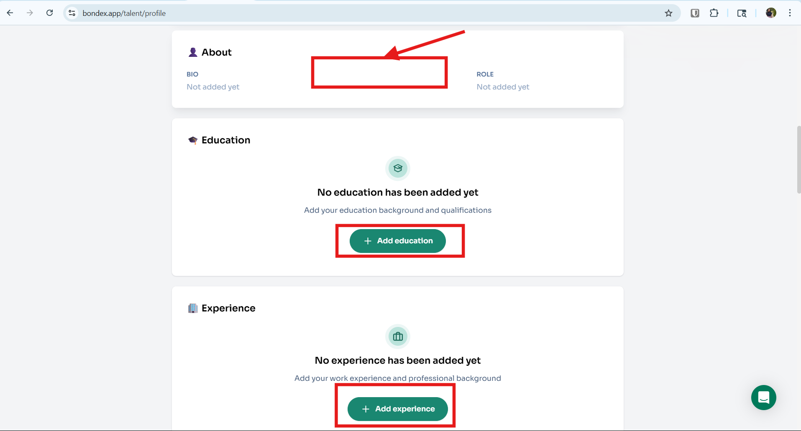
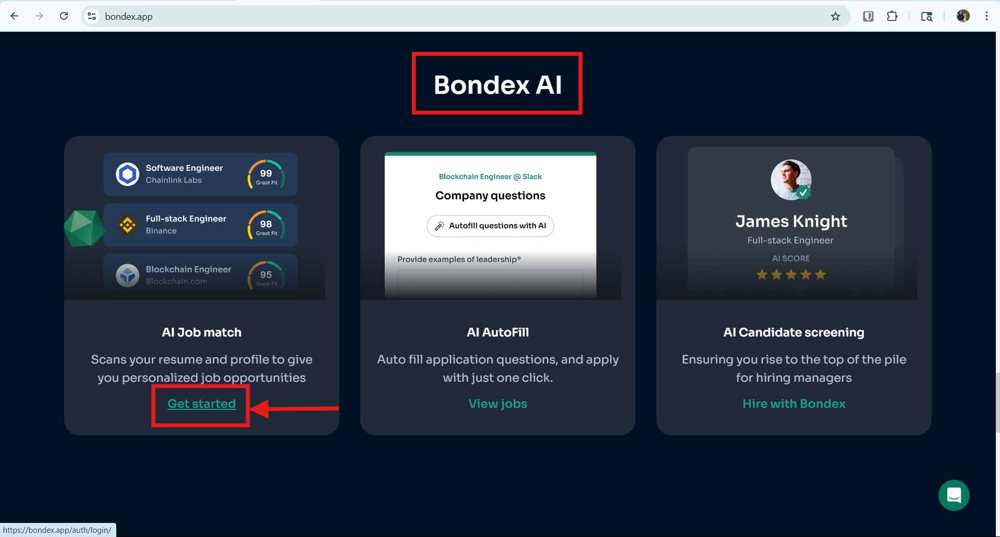
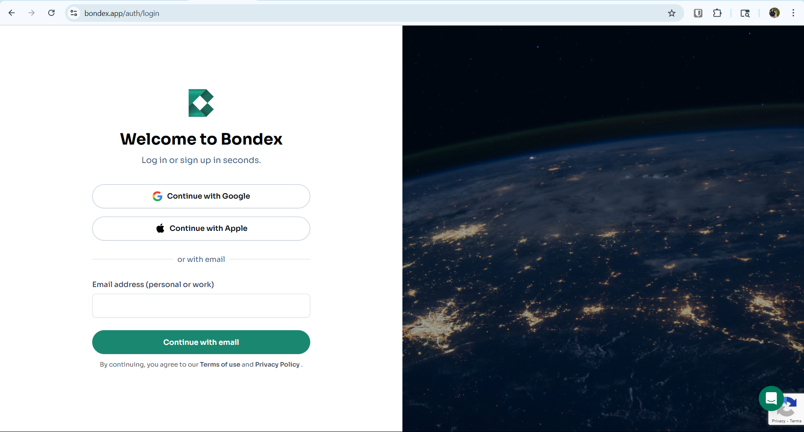
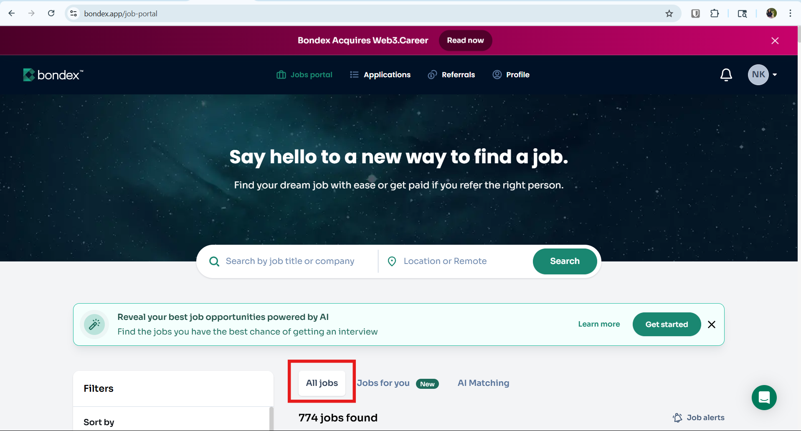

# Additional Functional and UX Observations - QA Evaluation

## 1. Missing "+ Add Bio" Button in Profile “About” Section

**Bug Quality:**  
- **Accuracy:** Clearly identifies a missing UI element (`+ Add Bio` button) in the "About" field of the profile page, compared to other profile sections.  
- **Reproducibility:** Easy to reproduce by logging in, navigating to https://bondex.app/talent/profile and inspecting the “About” field.  
- **Severity Judgment:** Medium severity — affects usability and UI consistency but does not block functionality.  
- **Evidence:** Screenshot contrasting the “About” section with other sections that have the button.

---

## 2. AI Job Match Button Redirect Bug

**Bug Quality:**  
- **Accuracy:** Precisely documents an incorrect redirect when clicking “Get Started” in “AI Job Match,” even if the user is logged in.  
- **Reproducibility:** Clear reproduction steps — clicking the button leads to sign-up page, then redirects to “All Jobs” instead of “AI Matching”.
- Click the "Get Started" button in the Bondex Home Page (Make sure you are loggend in)

- Redirected to Log In or Sign Up Page even if the user is already Logged In

- Sign In or Log In, and then user is redirected to "All Jobs" tab instead of "AI Matching"

- **Severity Judgment:** High-medium severity — breaks a key user flow, risking user frustration and drop-off.  
- **Evidence:** Screenshots or screen recordings of the redirect flow, login page, and incorrect landing page are recommended.

---

