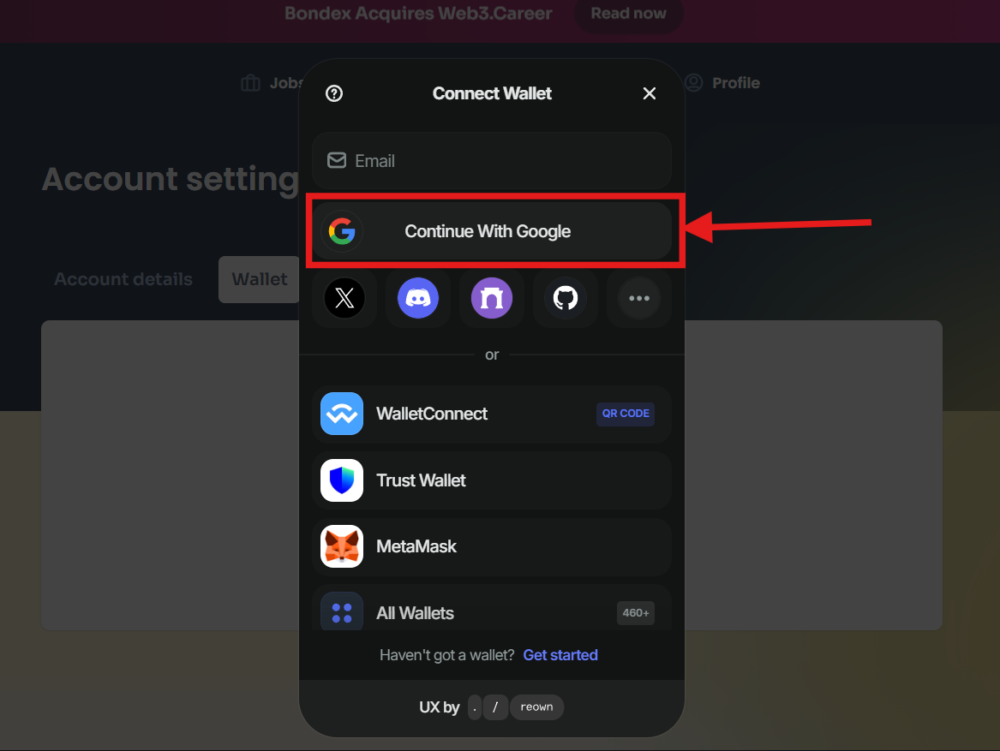

## Bug Title: Wallet Connection via Google Does Not Complete

**Environment:**
- Web: https://bondex.app
- Browser: Google Chrome
- OS: Windows 11
- Wallet Connection Method Failure

**Steps to Reproduce:**
1. Sign in to your account using the link: https://bondex.app/auth/login 
2. Click your profile icon which is top right of the page

3. Select “Account Settings” from the activated dropdown.

3. Navigate to the “Wallet” tab by selecting it

4. Click on the button “Connect Wallet”

5. A dialog box should appear, in that select “Continue with Google” as choice to connect wallet

6. A new tab opens showing Google account options
7. Select an account and confirm.

8. A message appears: _“Authentication successful. Go back to the application, don't close the tab”_

9. Return to the original Bondex tab and observe the activity happens

**Expected Result:**
Wallet should show as connected (e.g., wallet address or connected state displayed).

**Actual Result:**
App spins briefly, then returns to the original “Connect Wallet” state with no indication of a successful connection.

**Evidence:**
Loading...

Return to the Original State

**Severity:** High  
**Suggested Priority:** P1 – Critical user journey is broken.
