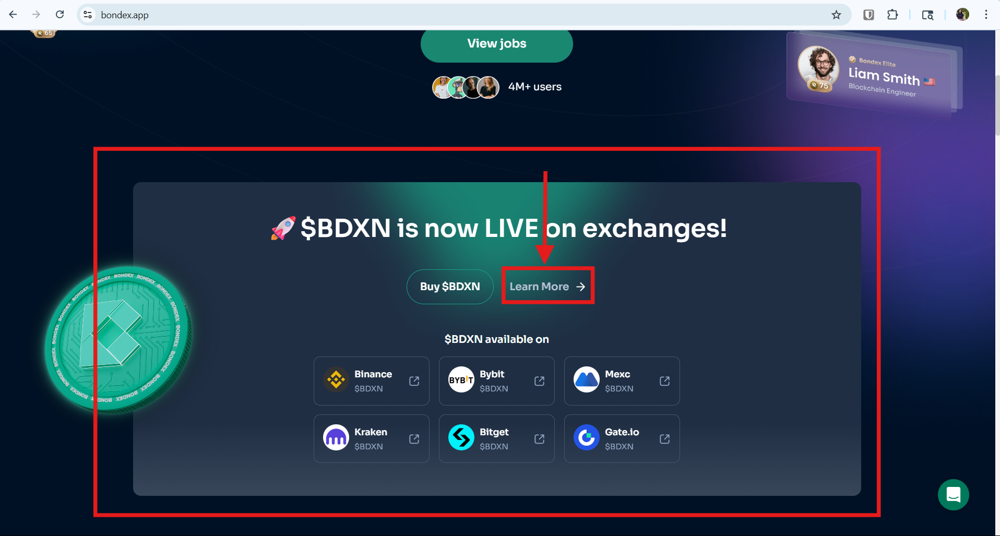

## Bug 2: “Google Play” Button Links to Apple App Store

**Environment:**
- Web: https://bondex.app
- Browser: Google Chrome
- OS: Windows 11
- “Google Play” Button Links to Apple App Store

**Steps to Reproduce:**
1. Open Bondex Home Page by using the link: https://bondex.app

2. Scroll to the footer in the Home Page

3. Under “Get the app” or anywhere in the Bondex WebPage, click on the “Google Play” button

4. Confirm that the Google Play tab, where you can download the Bondex app, opens after clicking the "Google Play" button

**Expected Result:**
User is redirected to the Google Play Store page for Bondex.

**Actual Result:**
User is redirected to the Apple App Store link instead.

**Notes:**
This issue appears on most instances of the “Google Play” button across the site.  
The only correctly working link is in:
- Home Page → "$BDXN is now LIVE on exchanges!" → "Learn more"

- ScroL;l down a little to "About Bondex" field → select "Download the App" 

- Which leads to this a QR code page: https://onelink.to/ddddwr, in that field navigate to "Available Downloads:" which has links to "iPhone", "iPad", "Android"
- Click on the "Android" link

**Evidence:**

**Severity:** Medium  
**Suggested Priority:** P2 – Functional error with marketing impact.
